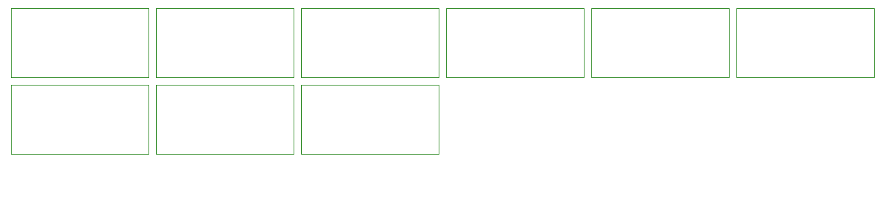

实现居中自适应居中，当元素不满一行时居中对齐，超过一行看似居左对齐




原理就是利用`inline-flex`变为内联元素，父元素中使用`text-align:center`实现居中。

那么，**块级元素需要使用`margin: 0 auto`来实现一样的效果**。

```html
<body>
  <div class="container">
    <div class="flex-box">
      <div class="item"></div>
      <div class="item"></div>
      <div class="item"></div>
    </div>
  </div>
</div>
</body>
```
```css
body {
  width: 100%;
}

.container {
  text-align: center;
}

.flex-box {
  display: inline-flex;
  flex-wrap: wrap;
}

.item {
  margin-top: 10px;
  margin-right: 10px;
  width: 100px;
  height: 100px;
  border: 1px solid forestgreen;
}
```
